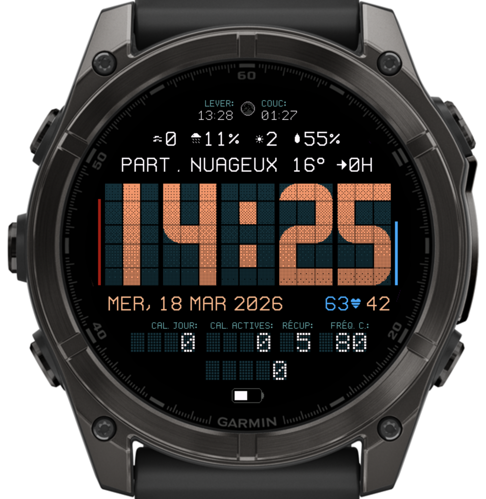
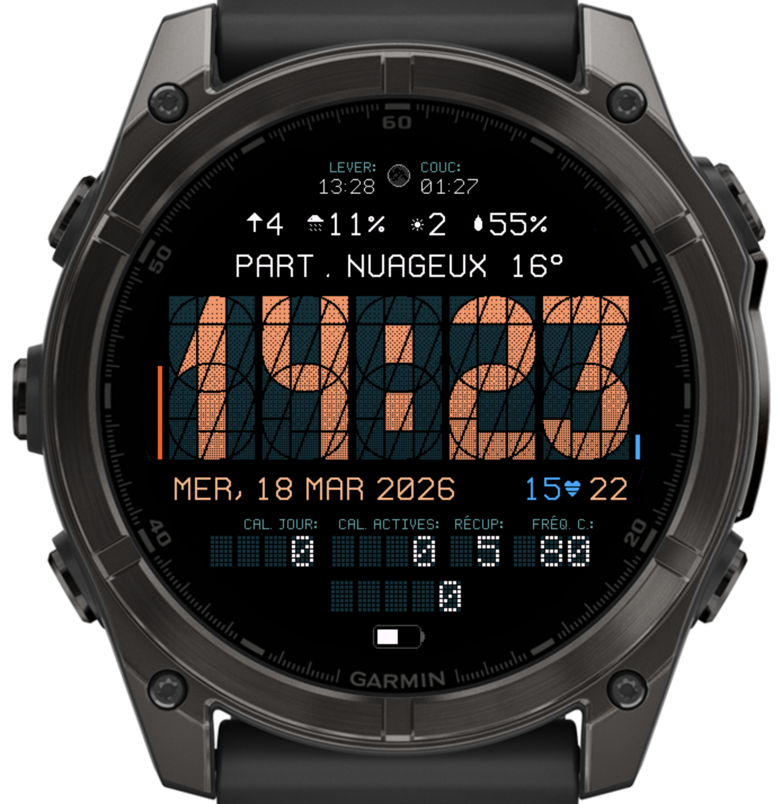

# Segment34Plus

A watchface for Garmin watches with a 34-segment display, forked from [Segment34 MkII](https://github.com/ludw/Segment34mkII) after [PR #76](https://github.com/ludw/Segment34mkII/pull/76) was rejected.

| Forecast Cycling | Alternate Layout |
| --- | --- |
|  |  |

## Features

- Time displayed with a 34-segment display
- Phase of the moon with graphic display
- Heartrate or Respiration rate
- Weather (conditions, temperature, windspeed, precipitation, UV index, humidity)
- Wind / Precip / UV / Humidity combo line option with icons
- Sunrise / Sunset
- Date
- Notification count
- Configurable: Active minutes / Distance / Floors / Time to Recovery / VO2 Max
- Configurable: Steps / Calories / Distance
- Battery days remaining (or percentage on some watches)
- Always-on mode
- Settings in the Garmin app

## Differences from upstream Segment34 MkII

Compared with `upstream/main` on 2026-03-18.

### Added in this fork

- **More weather-focused line presets**: `Wind / Precipitation / UV`, `Wind / Precipitation / UV / Humidity`, and a cycling `Weather conditions / Feels Like / Until When` line
- **France-tuned weather provider option**: keep Garmin Weather or switch to `Open-Meteo France`, fetched in a background service and normalized for the existing weather layouts
- **Extra presentation options**: a `4, 4, 2, 3` bottom layout, right-aligned bottom labels, and a `°`-only temperature unit
- **More uses for the notification slot**: it can show heart rate or resting heart rate
- **Visual tweaks not in upstream**: a `Peachy Orange on turquoise` theme, LED-style icon redraws, a humidity icon, and `ALT (M)` / `ALT (FT)` labels
- **Different defaults** tuned around the fork's weather-first layout

### Not carried over from current upstream

- **Custom color themes** and the upstream online theme-designer workflow
- **Night-theme features**: a separate night theme, scheduled switching, and tap-to-toggle night mode
- **Histogram mode** for the top section
- **Alternative timezone fields**
- **Clock display options** added upstream: gradient controls, outline-only mode, and AM/PM display
- **Update-frequency control**
- **The upstream distance simplification**: one shared distance-unit setting for all distance fields
- **Upstream's per-sport rolling distance fields** for run distance and bike distance over the last 7 days
- **Upstream's broader zero-notification hiding**, which is more consistent across placements

### Technical notes

- **Forecast cycling came with hard memory tradeoffs**: to stay within Connect IQ class-member limits on older MIP watches, this fork bit-packs many settings and drops some upstream features, most notably histogram and alternative timezone support
- **Rendering work is reduced** through cached system/weather reads, cached strings, cached weather resource IDs, cached sensor lookups, and cached field-width calculations
- **Font and bitmap resources are split by screen size**, which keeps the per-device binaries smaller than the shared-resource approach in upstream

## FAQ

https://github.com/Rubilmax/Segment34Plus/blob/main/FAQ.md

## Weather Providers

`Garmin Weather` remains the default provider.

`Open-Meteo France` uses Open-Meteo's `/v1/meteofrance` endpoint with Météo-France-backed forecast models. It is intended for users in France who want a more France-tuned forecast source while keeping the existing weather fields and forecast cycling.

The Open-Meteo provider uses automatic location only. The watch face resolves the current position from the device when available, falls back to the last known Garmin weather location, and then to the last successful Open-Meteo fetch location.

Attribution: weather data for the France-tuned provider is delivered by Open-Meteo using Météo-France forecast models.

## IQ Store Listing

https://apps.garmin.com/apps/e8964cd6-53da-4004-aa03-1566c5d577e4
